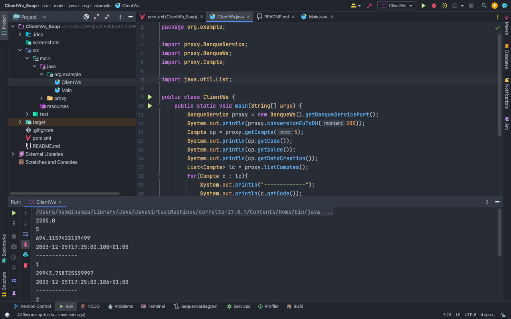

# Project Title: ClientWs

This Java project serves as a client to consume the `BanqueWs` Web Service for banking-related operations.

## Table of Contents

- [Introduction](#introduction)
- [Usage](#usage)
- [Screenshots](#screenshots)
- [Installation](#installation)
- [Contributing](#contributing)
- [Server Repository](#server-repository)

## Introduction

This Java project acts as a client to interact with the `BanqueWs` Web Service, performing currency conversion, getting an account, and listing accounts.

## Usage

To use this Java client, follow these steps:

1. Clone the repository.
2. Open the project in your preferred Java IDE.
3. Run the `ClientWs` class to consume the Web Service.

## Screenshots

Client Test.

## Installation

Ensure you have Java and a suitable IDE installed. Clone the repository and import the project into your IDE.

## Contributing

Feel free to contribute to this project. Fork the repository, make your changes, and submit a pull request.

## Server Repository

The client interacts with the `BanqueWs` Web Service. The server's source code and details can be found in the following repository:

[BanqueWs Server Repository](https://github.com/Hamhamdi/TPWS_SOAP.git)

